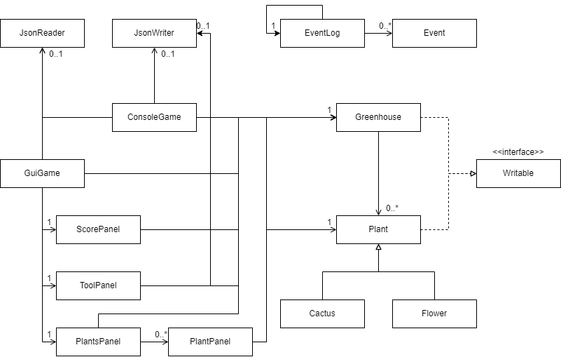

# Greenhouse Manager

## Description

The main premise of **Greenhouse Manager** is to buy and care for plants and sell them to make a profit. To win the 
game the user must use revenue from plant sales to pay off their business loan debt. Once the debt is paid, *the user 
wins the game*. The audience for this game is anyone interested in simulation games or plants. I chose this project because in 
my many personal projects I have never developed a game before and would like to challenge myself by trying to develop 
something new for myself. I specifically chose simulating plant care because I enjoy the agriculture feature in main 
stream games like Minecraft and Animal Crossing.

## User Stories

### Phase 1 (Implemented)
1. ~~As a user, I want to be able to purchase seeds~~
2. As a user, I want to be able to ~~plant seeds~~ buy plants in my greenhouse
3. As a user, I want to watch the baby plant grow into a mature plant over time
4. As a user, I want the option to water my plant as it grows
5. As a user, I want the option to sell my plant for money
6. As a user, I want to see a list of the plants I have in my green house along with their age and hydration level

## Phase 2 (Implemented)
1. As a user, I want the option to start a new game
2. As a user, I want the option to be able to save the state of my game 
3. As a user, I want the option to restore a previously saved game when I run the game

### Phase 3 (Implemented)
1. As a user, I want the option to pay off my loan using the money I generate from sales
2. As a user, if my debt reaches zero, I want to *win the game*
3. As a user, I want to be limited to the number of plants I have at a given moment by the number of pots I own
4. As a user, I want to be able to buy more pots to allow me to grow more plants in the game
5. **Seeds have been deprecated, user just buys plants that start at age zero**
6. 1. As a user, I want the plant to be removed from the greenhouse if hydration reaches zero
7. As a user, I want the option to buy a cactus.
> The cactus plant grows slowly and requires less frequent watering.
The cactus can be sold for a profit when it reaches a mature age, otherwise it is sold for a loss.
8. As a user, I want to be able to plant a flower
> The flower plant grows faster compared to the cactus but requires more frequent watering.
    The flower can be sold for a profit when it reaches a mature age. otherwise it is sold for a loss.
    When the flower is ready to be sold it blooms to a random color, that can influence the sale price.
    The more rare the color it blooms to, the higher the sale price of the flower.
9. As a user, I want to be able to play the game with a GUI

# Instructions for Grader
- when you run the app, press "new game" and enter a name for the game file
- you can generate the action of "adding X to Y" by pressing "Buy Cactus" or "Buy Flower"
- You should see visual component which will be a picture of a pot with a plant growing as the plant
  (either cactus or flower) ages with time.
- You can right-click on the image of the plant and pressing "water plant", this will reset the hydration level
- You can generate the action of "removing X from Y" by right-clicking on a plant and selecting "sell plant", I
  recommend waiting a while for the plant to mature so it can be sold for a profit
- You can press "Save Game" to save the state of the game
- After saving, you can quit the game and re-open the game. 
- On the splash screen select "load game" to load a game file Enter the name you used when creating a new game, 
here the game will load from the point it was saved last.

# Phase 4: Task 2
```console
Printing Event Log
Tue Nov 28 19:25:31 PST 2023: Created new greenhouse owned by: Alberto
Tue Nov 28 19:25:32 PST 2023: Alberto has purchased a cactus called 4T0U5
Tue Nov 28 19:25:34 PST 2023: Alberto has purchased a flower called 2LU9Q
Tue Nov 28 19:25:35 PST 2023: Alberto has purchased a cactus called SA18W
Tue Nov 28 19:25:54 PST 2023: Alberto has watered 2LU9Q Flower
Tue Nov 28 19:25:56 PST 2023: Alberto has watered 4T0U5 Cactus
Tue Nov 28 19:26:10 PST 2023: 2LU9Q Flower has bloomed into a Red Flower
Tue Nov 28 19:26:12 PST 2023: Alberto has watered 2LU9Q Flower
Tue Nov 28 19:26:14 PST 2023: Alberto has watered 4T0U5 Cactus
Tue Nov 28 19:26:17 PST 2023: Alberto has sold 2LU9Q Flower for $90
Tue Nov 28 19:26:28 PST 2023: Alberto has watered SA18W Cactus
Tue Nov 28 19:26:30 PST 2023: Alberto has watered 4T0U5 Cactus
Tue Nov 28 19:26:33 PST 2023: Alberto has purchased a flower called OKQRC
Tue Nov 28 19:26:57 PST 2023: Alberto has watered OKQRC Flower
Tue Nov 28 19:27:09 PST 2023: OKQRC Flower has bloomed into a Red Flower
Tue Nov 28 19:27:11 PST 2023: Alberto has sold OKQRC Flower for $90
Tue Nov 28 19:27:13 PST 2023: Alberto has bought a pot
Tue Nov 28 19:27:15 PST 2023: Alberto has purchased a flower called IZKRN
Tue Nov 28 19:27:26 PST 2023: Alberto has sold 4T0U5 Cactus for $130
Tue Nov 28 19:27:28 PST 2023: Alberto has sold SA18W Cactus for $130
Tue Nov 28 19:27:31 PST 2023: Alberto has purchased a flower called WTEMG
Tue Nov 28 19:27:32 PST 2023: Alberto has purchased a flower called 8SERQ
Tue Nov 28 19:27:34 PST 2023: Alberto has purchased a flower called XQ41J
Tue Nov 28 19:27:49 PST 2023: Alberto has watered WTEMG Flower
Tue Nov 28 19:27:50 PST 2023: Alberto has watered 8SERQ Flower
Tue Nov 28 19:27:51 PST 2023: Alberto has watered XQ41J Flower
Tue Nov 28 19:28:07 PST 2023: WTEMG Flower has bloomed into a Red Flower
Tue Nov 28 19:28:08 PST 2023: 8SERQ Flower has bloomed into a Black Flower
Tue Nov 28 19:28:10 PST 2023: XQ41J Flower has bloomed into a Red Flower
Tue Nov 28 19:28:13 PST 2023: Alberto has sold WTEMG Flower for $90
Tue Nov 28 19:28:18 PST 2023: Alberto has sold XQ41J Flower for $90
Tue Nov 28 19:28:51 PST 2023: Alberto has sold 8SERQ Flower for $680
Tue Nov 28 19:28:56 PST 2023: Alberto has paid $500 of debt
```

# Phase 4: Task 3


If I had more time to work on this project I would do the following:
1. I would implement an observer pattern in my model package. The reason I would do this is that my project 
focuses on updating various plants over time and having fields of the plant update as time passes. This
refactoring would help manage the update events in my code.
2. I would add another class that would manage the financial aspect of the Greenhouse. Currently, managing debt, wallet,
and purchasing of plants and pots are all methods within Greenhouse. It would be easier to manage the codebase if these
 methods are in another class.
3. I would add a feature that would change the base price over time. This would add an element of the user having to
careful consider when to buy plants, so they are sold during a market high. This kind of feature would make the game act
 similar to the stock market.

